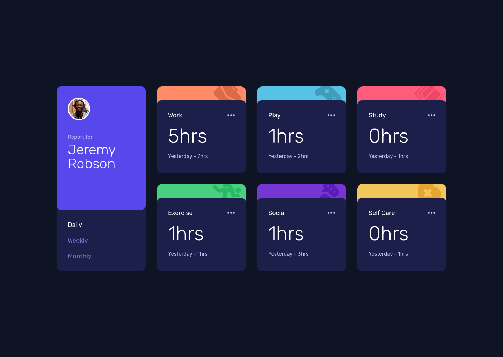

# Frontend Mentor - Time tracking dashboard solution

This is a solution to the [Time tracking dashboard challenge on Frontend Mentor](https://www.frontendmentor.io/challenges/time-tracking-dashboard-UIQ7167Jw).

### Table of contents 

- [Overview](#overview)
    - [Screenshot](#screenshot)
    - [Links](#links)
- [My process](#my-process)
    - [Built with](#built-with)
    - [The most important part](#the-most-important-part)
- [Author](#author)

## Overview

### Screenshot

### Links

Live Site URL: [GitHub Pages](https://konradjam.github.io/time-tracking-dashboard/)

## My process

### Built with

- Semantic HTML 5 markup
- CSS logic properties
- Mobile-first workflow
- Flexbox and Grid
- RWD
- Sass
- BEM
- Accessibility
- JavaScript

### The most important part
I completed this challenge using AI. I used Cursor AI in Agent mode. The AI helped me with the basic, boring parts of the challenge. This allowed me to concentrate on the JavaScript.

## Author

- LinkedIn [KonradJam](www.linkedin.com/in/konradjam)
- X [KonradJam_](https://x.com/KonradJam_)
- Frontend Mentor [KonradJam](https://www.frontendmentor.io/profile/KonradJam)
- Codewars [KonradJam](https://www.codewars.com/users/KonradJam)
- CodePen [KonradJam](https://codepen.io/konradjam)